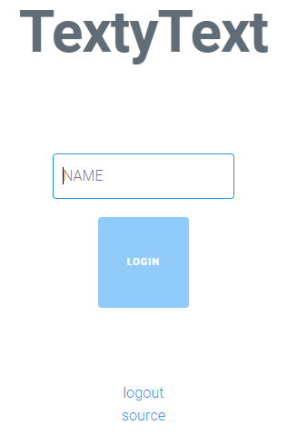
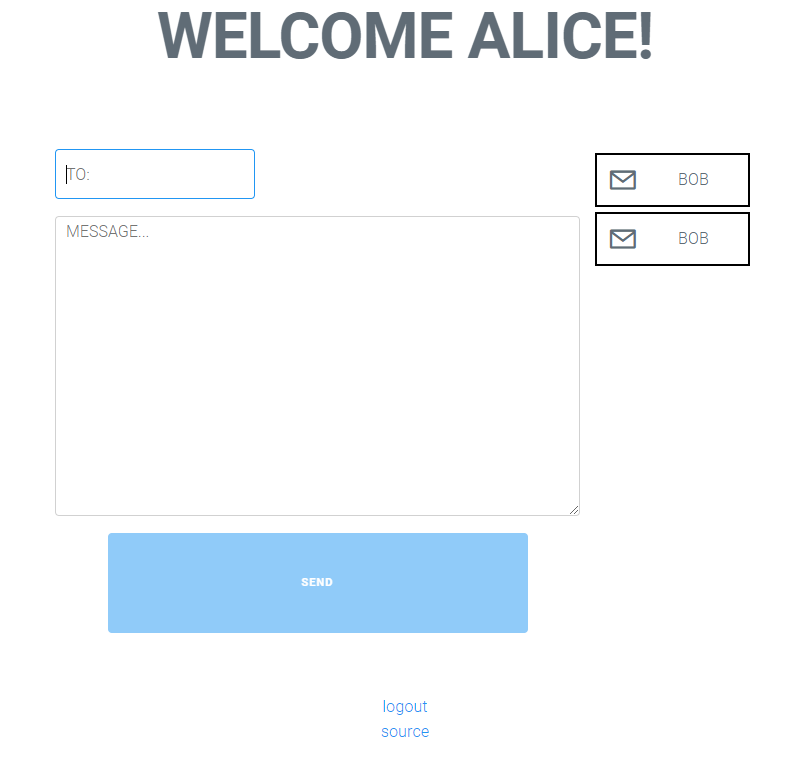
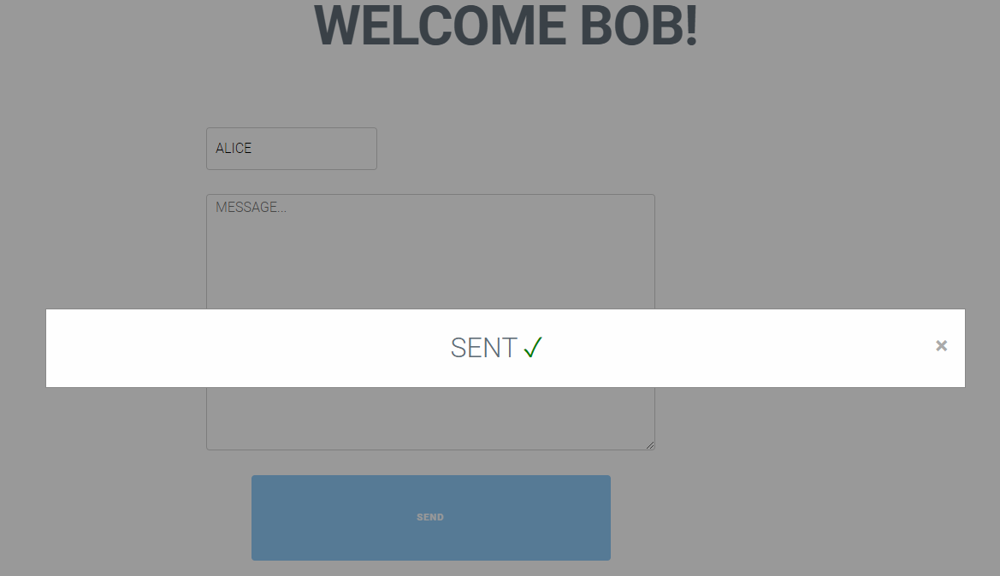
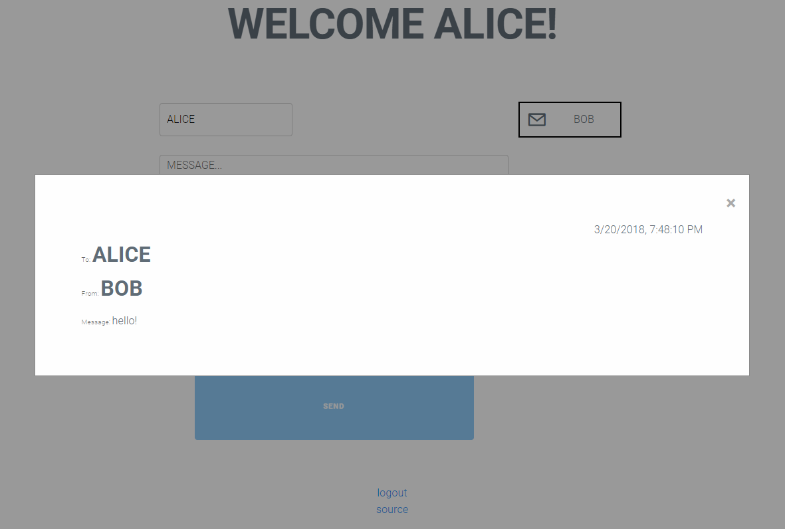

# TextyText

This is another implementation of [snaptext](https://github.com/schollz/snaptext).

Essentially, it's a messaging service that deletes a message when it gets delivered.
It uses websockets so that messages are delivered in real time.

This one has a different style. The code is very small. The client is ~400 lines of HTML/JS/CSS
not counting some (also very small) vendored dependencies. The server is ~150 lines of Go.

To run the client:

```
cd client/
python3 -m http.server 8080
```

To run the server script:

```
cd server/
go get -v
go build
./server
```

## Screenshots

---



---



---



---



---
